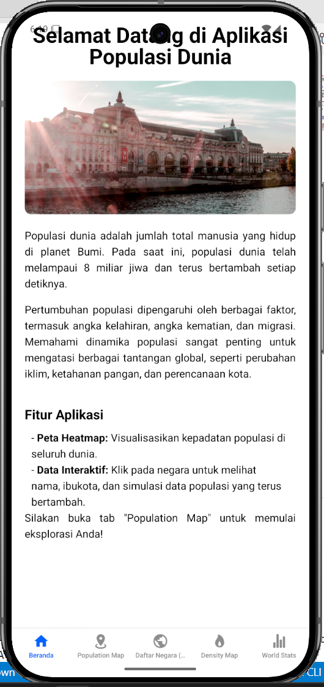
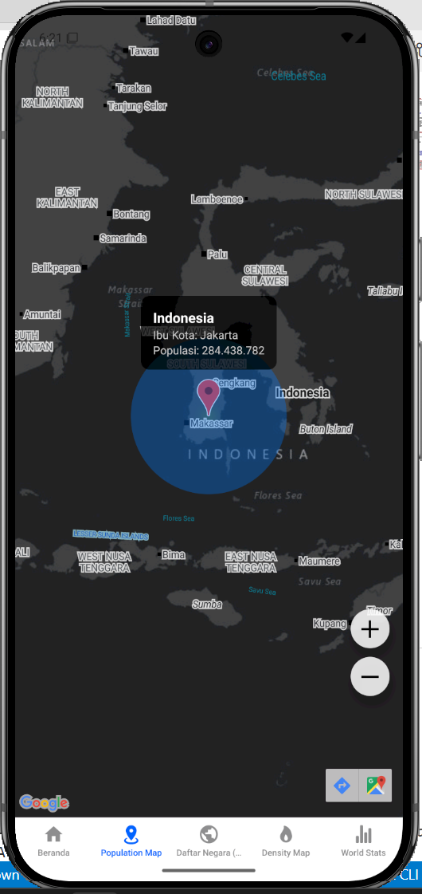
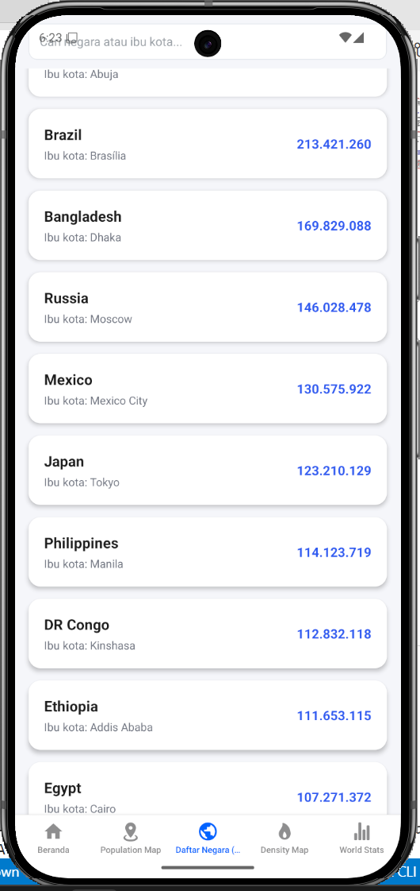
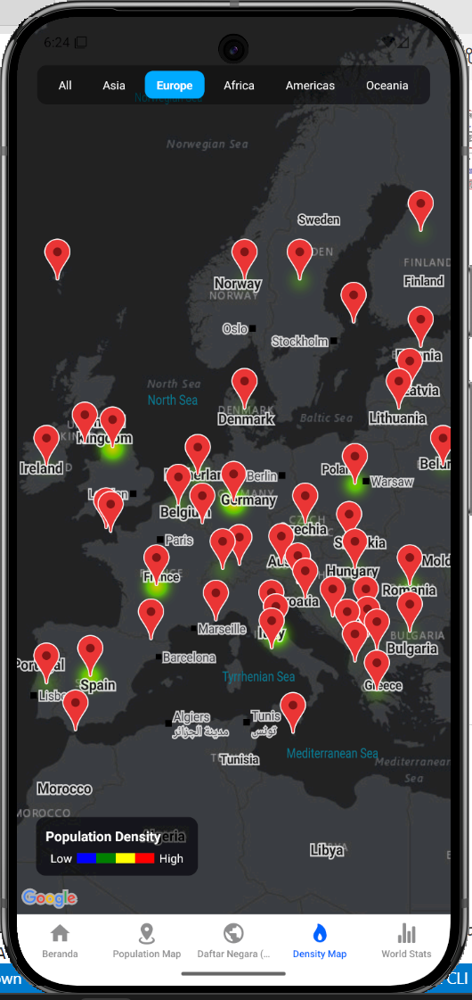
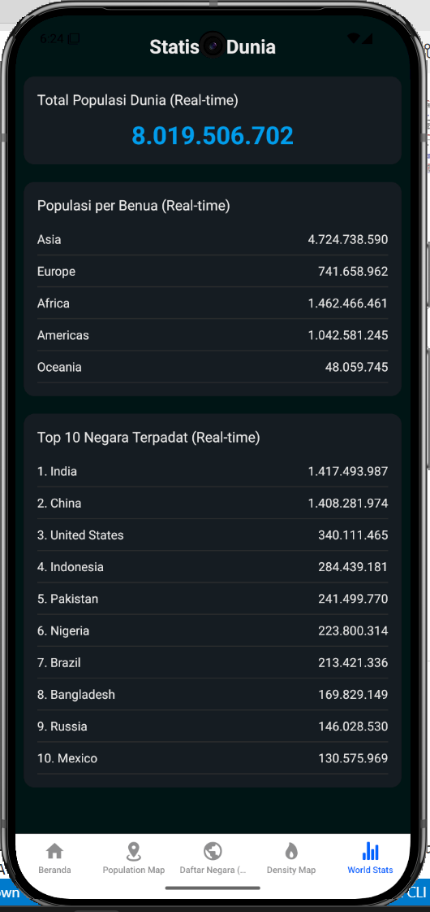

# RESPONSI_PGPBL_515601_SHERYN_ALYA

 
 

---

## Nama
**GeoPop (Global Population Explorer)**

## Deskripsi
Aplikasi ini menampilkan data kependudukan dan peta kepadatan secara interaktif.  
Fitur utama:  
- Statistik populasi wilayah  
- Peta distribusi penduduk  
- Navigasi antar tab untuk data dan peta  
- Visualisasi peta dengan GeoJSON  

---

## Komponen Pembangun

| Komponen        | Teknologi / Library       | Fungsi                                      |
|-----------------|-------------------------|--------------------------------------------|
| Frontend        | React Native (Expo)     | UI dan navigasi aplikasi                    |
| Peta / GIS      | Leaflet / GeoJSON       | Menampilkan peta interaktif                |
| Data Handling   | JavaScript / JSON       | Mengelola data kependudukan dan peta       |
| Assets          | Gambar & ikon           | Mendukung visualisasi                       |

---

## Sumber Data
- **Data kependudukan:** [Contoh Sumber / Dataset Resmi]  
- **GeoJSON wilayah:** [Contoh Sumber / Dataset Resmi]  
- **File pendukung:** `assets/data` dan `assets/images`  

---

 ## Tangkapan Layar Komponen Penting

